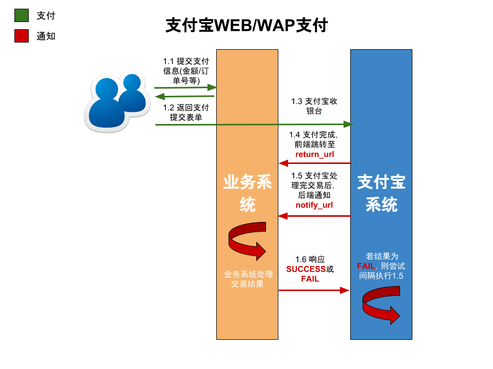

# Alipay[](https://travis-ci.org/ihaolin/alipay)

轻量的支付宝组件(A Lightweight Alipay Component)
---

+ 包引入:
	
	```xml
	<dependency>
        <groupId>me.hao0</groupId>
        <artifactId>alipay-core</artifactId>
        <version>1.3.0</version>
    </dependency>
	```

+ 业务系统与支付宝系统交互图:
	
	
	
+ 基本用法:
	
	```java
	Alipay alipay = AlipayBuilder
                    .newBuilder(merchantId, secret)
                    .config1(...)	// 其他可选配置
                    ...
                    .build();
    
    alipay.module().api();
	```

+ 已实现的组件:

	+ 支付``pay()``;
	+ 退款``refund()``;
	+ 验证``verify()``。
		
+ API文档[这里](API.md)。

+ **关于测试**: [测试用例中](src/test/java/me/hao0/alipay/AlipayTest.java)是一些基本测试，[alipay-demo](alipay-demo)项目是一个可运行web项目，方便测试，可按如下步骤进行测试: 
	
	+  复制[alipay-demo](alipay-demo)中的``app-example.properties``为``app.properties``，并作相应配置:

		```ruby
		## 支付宝商户编号
		merchantId=
		## 支付宝密钥
		secret=
		## 支付通知url
		payNotifyUrl=${your_domain}/notifies/backend
		## 退款通知url
		refundNotifyUrl=${your_domain}/notifies/refund
		## web支付完成页面跳转url
		webReturnUrl=${your_domain}/notifies/web/frontend
		## wap支付完成页面跳转url
		wapReturnUrl=${your_domain}/notifies/wap/frontend
		```
	
	+ **注意**：除了**``webReturnUrl``**, **``wapReturnUrl``**可以配置为**``localhost``**外，**``payNotifyUrl ``**和**``refundNotifyUrl``**都应该配置为支付宝可以外网调用的地址，本地测试建议使用[ngrok](https://ngrok.com/)工具来作本地外网映射。

	+ 到[alipay-demo](alipay-demo)根目录运行以下命令即可:

		```bash
		mvn clean jetty:run -Dmaven.test.skip -Djetty.port={自定义端口号}
		```
	
	+ WEB支付可访问(**请求正常后，应该会跳到支付宝收银台页面，完成支付后，过几秒页面会跳转到``webReturnUrl``，console里也会有服务器通知的日志出现**):
		
		```bash
		http://localhost:{port}/pays/web?orderNumber={自定义订单号}
		```	

	+ WAP支付可访问(**请求正常后，应该会跳到支付宝收银台页面，完成支付后，过几秒页面会跳转到``wapReturnUrl``，console里也会有服务器通知的日志出现**):
	
		```bash
		http://localhost:{port}/pays/wap?orderNumber={自定义订单号}
		```
	
	+ 退款可访问(**退款成功后，也会有服务器通知日志打印**):

		```bash
		http://localhost:{port}/refunds/submit?batchNo={自定义批次号}&tradeNo={服务器通知日志中的tradeNo}
		```
	
	+ APP支付: 
		
		1. 客户端支付未亲测;
		2. 支付成功后，支付宝的通知数据RSA校验已测试通过。 
	
+ 相关文档:
	
	+ [即时到帐](http://doc.open.alipay.com/doc2/detail?treeId=62&articleId=103566&docType=1)；
	+ [WAP支付](http://doc.open.alipay.com/doc2/detail?treeId=60&articleId=103564&docType=1)；
	+ [APP支付](http://doc.open.alipay.com/doc2/detail?treeId=59&articleId=103563&docType=1)。

+ 历史版本:

	+ 1.0.0:
		
		+ 基本功能实现。
	
	+ 1.0.1:
		
		+ 必要参数校验。

	+ 1.0.2:

	    + 升级最新[common](https://github.com/ihaolin/common)组件；
	    + 参数校验简化。

	+ 1.0.3:

	    + 在alipay-demo中判断交易状态，web,wap只会在交易成功后通知，app还会在交易创建后作通知.

	+ 1.0.4:

	    + APP支付增加**body**和**goodsType**参数。

	+ 1.0.5:

	    + APP支付必须构参**body**
	    + 配置可选**secret**

	+ 1.0.6:

	    + 单元测试编译错误.

	+ 1.0.7:

	    + APP支付sign进行encode.
    
    + 1.0.8:
    
        + APP支付**goodsType**参数可选.
    
    + 1.0.9:
        
        + 提升代码质量
        
            + DevFactory/release/silly-quality-checks-should-be-removed-fix-1
            + DevFactory/release/general-cod-quality-fix-1
    
    + 1.0.10:
        
        + 移除**paymethod**参数, 均使用默认支付方式directPay.  
          
    + 1.1.0:
        
        + PC支付增加**extra_common_param**参数.
    
    + 1.2.0:
            
        + PC支付增加**anti_phishing_key**参数, 防钓鱼.
    
    + 1.3.0:
        
        + 提供支付超时配置选项**it_b_pay**(`AlipayBuilder.payExpired()`).

## 有事请烧钱

+ 支付宝:
		
	
	
+ 微信:

	
	
        